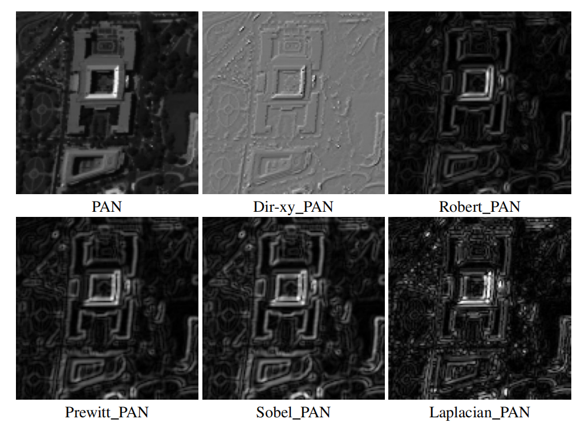
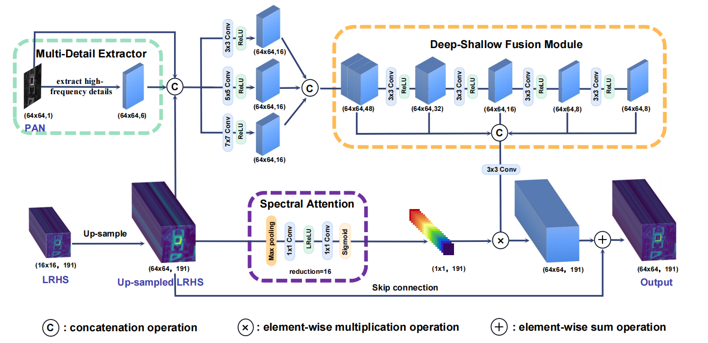
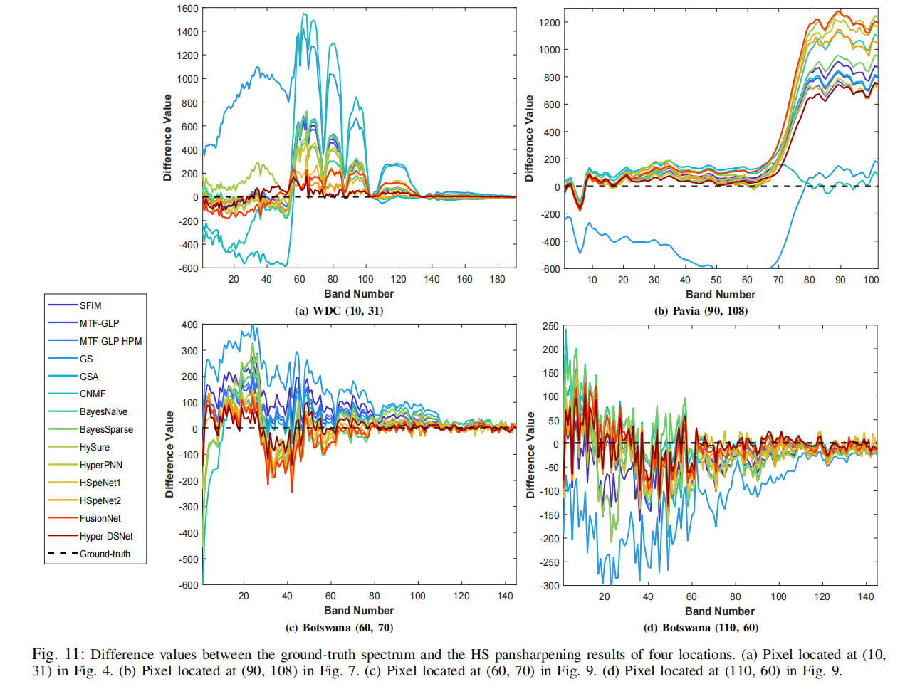
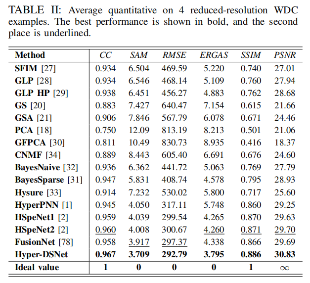

# Hyper-DSNet

* **Homepage:** https://liangjiandeng.github.io/ 
* Code for the paper: "A Deep-Shallow Fusion Network with Multi-Detail Extractor and Spectral Attention for Hyperspectral Pansharpening"

# Dependencies and Installation

* Python 3.8 (Recommend to use [Anaconda](https://www.anaconda.com/))
* Pytorch 1.7.0
* NVIDIA GPU + CUDA
* Python packages: `pip install numpy scipy h5py`
* TensorBoard

# Dataset

* The simulated datasets used in this paper are Washington DC Mall, Pavia Center and Botswana Dataset. Here we provide complete training and testing data for download.

  | Dataset            | Link                                            | Password |
  | ------------------ | ----------------------------------------------- | -------- |
  | Washington DC Mall | https://pan.baidu.com/s/120NwAPBZEICRk-lQPCl8Rg | ap12     |
  | Pavia Center       | https://pan.baidu.com/s/1cp9mdh0EutJZyoCi2yyWZw | g118     |
  | Botswana           | https://pan.baidu.com/s/1coTz6eBt26Ks4kswAio2Fw | 1w6e     |

* The Full-resolution dataset FR1 can be downloaded [here](https://openremotesensing.net/hyperspectral-pansharpening-challenge/). Also, we provided the prepared data used in this paper.

  | Dataset | Link                                            | Password |
  | ------- | ----------------------------------------------- | -------- |
  | FR1     | https://pan.baidu.com/s/1cuglyEGSejCFOXC7Epg8yQ | 3951     |

  

# Code

* data.py: The dataloader of the training and testing data.
* main.py: The training and testing function of our Hyper-DSNet.
* model.py: The whole model of our Hyper-DSNet.
* EdgeDetection.py: The preprocessing part of each operator extracting details.

For training, you need to set the file_path in the main function, adopt to your train set, validate set, and test set as well. Our code train the .h5 file, you may change it through changing the code in main function.

As for testing, you need to set the path in both main and test function to open and load the file.

# Method

* Motivation:
  * In some of existing approaches, the particularity of remote sensing images is ignored due to all features extracted from input images being treated identically, further restricting the ability to employ relevant information selectively. 
  * Besides, for PAN images, pioneer works often feed them directly into the network together with HS images or use a fifixed high-frequency template for preprocessing, which will inevitably lose some spatial information.
* Proposed MDE module:
  

* Overall Architecture

* Visual Results

* Quantitative Results

* Please see the paper for other details.

# Contact

We are glad to hear from you. If you have any questions, please feel free to contact Yuuweii@yeah.net.

