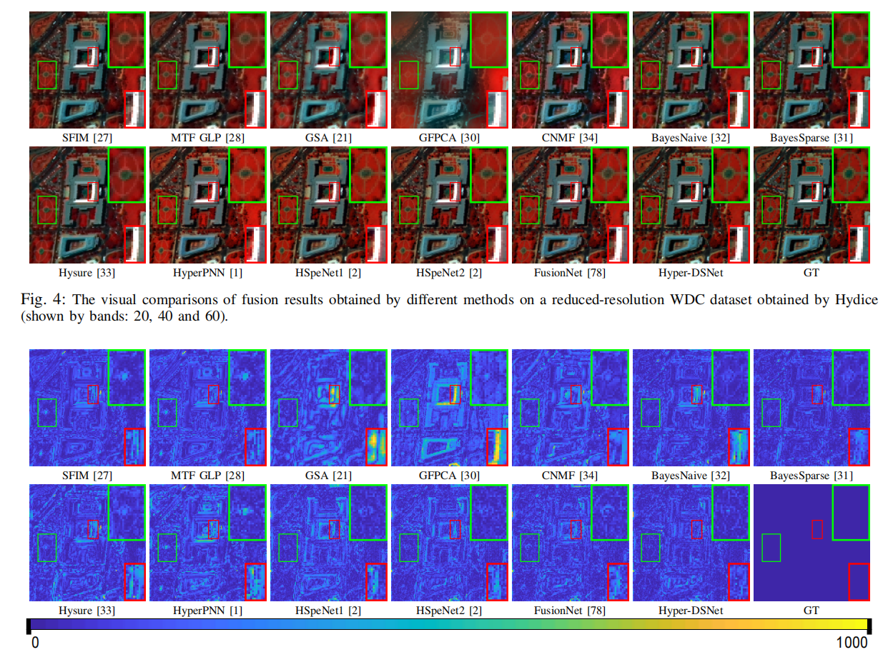

# Hyper-DSNet 
## Source Codes and Datasets for Hyperspectral Pansharpening in Deep Learning


* **Homepage:** https://liangjiandeng.github.io/ 
* Code for the paper: "A Deep-Shallow Fusion Network with Multi-Detail Extractor and Spectral Attention for Hyperspectral Pansharpening, IEEE JSTARS, 2022"


## Reference
Please cite the related paper:

```bibtex
@ARTICLE{zhuo2022jstars,
  author={Zhuo, Yu-Wei and Zhang, Tian-Jing and Hu, Jin-Fan and Dou, Hong-Xia and Huang, Ting-Zhu and Deng, Liang-Jian},
  journal={IEEE Journal of Selected Topics in Applied Earth Observations and Remote Sensing}, 
  title={A Deep-Shallow Fusion Network with Multi-Detail Extractor and Spectral Attention for Hyperspectral Pansharpening}, 
  year={2022},
  volume={},
  number={},
  pages={},
  doi={10.1109/JSTARS.2022.3202866}
}
```


## Dependencies and Installation

* Python 3.8 (Recommend to use [Anaconda](https://www.anaconda.com/))
* Pytorch 1.7.0
* NVIDIA GPU + CUDA
* Python packages: `pip install numpy scipy h5py`
* TensorBoard


## Dataset

* Please find the related dataset for this paper, i.e., [[HyperPanCollection](https://github.com/liangjiandeng/HyperPanCollection)], which includes Washington DC Mall, Pavia Center, Botswana and a real (or full-resolution) dataset FR1.

* More info. about these datasets can be found from the published paper.

  

## Code

* data.py: The dataloader of the training and testing data.
* train.py: The main training function of our Hyper-DSNet.
* model.py: The whole model of our Hyper-DSNet.
* EdgeDetection.py: The preprocessing part of each operator extracting details.
* test.py: The main testing function of our Hyper-DSNet.
* Q_sam_ergas: Function to calculate ERGAS and SAM in python.


## Get Started

1. For training, you need to set the file_path in the main function, adopt to your train set, validate set, and test set as well. Our code trains the .h5 file, you may change it through changing the code in data function.
2. After prepareing the dataset, you can modify the model and experiment hyperparameters as needed, such as epoch, learning rate, convergence function, etc. 
3. At the same time, you also need to set the path where the model and log are saved.
4. Then you can start training, the code will automatically save the trained model in .pth format.
5. As for testing, you also need to set the path to open and load the data and trained .pth file, and get the test result in .mat format.


## Method

* Motivation:
  * In some of existing approaches, the particularity of remote sensing images is ignored due to all features extracted from input images being treated identically, further restricting the ability to employ relevant information selectively. 
  * Besides, for PAN images, pioneer works often feed them directly into the network together with HS images or use a fifixed high-frequency template for preprocessing, which will inevitably lose some spatial information.
* Proposed MDE module:
  

* Overall Architecture


* Visual Results




* Quantitative Results


* Please see the paper for other details.


## Contact

We are glad to hear from you. If you have any questions, please feel free to contact Yuuweii@yeah.net.


